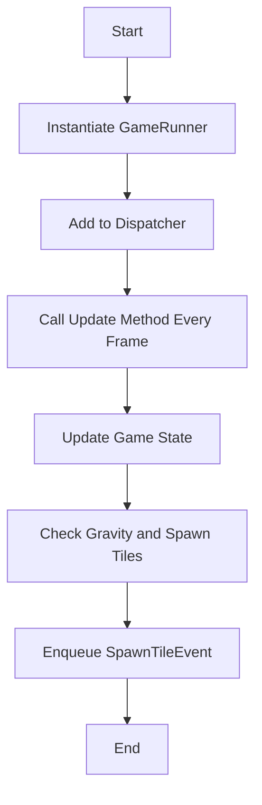

The <SwmToken path="unity/four-block/Assets/gamerunner/GameRunner.cs" pos="11:4:4" line-data="public class GameRunner : IUpdatable">`GameRunner`</SwmToken> class is responsible for managing the game's main loop and updating game state.

It uses a <SwmToken path="unity/four-block/Assets/gamerunner/GameRunner.cs" pos="13:3:3" line-data="    private ServiceLocator _serviceLocator;">`ServiceLocator`</SwmToken> to access various services like <SwmToken path="unity/four-block/Assets/gamerunner/GameRunner.cs" pos="26:11:11" line-data="        var gravity = _serviceLocator.GetService&lt;GravityService&gt;();">`GravityService`</SwmToken>, <SwmToken path="unity/four-block/Assets/gamerunner/GameRunner.cs" pos="17:3:3" line-data="    public TileSpawnerService.CreateTileShapeDelegate CreateTileShape;">`TileSpawnerService`</SwmToken>, and <SwmToken path="unity/four-block/Assets/gamerunner/GameRunner.cs" pos="39:3:3" line-data="            var eventQueue = _serviceLocator.GetService&lt;EventQueue&gt;();">`eventQueue`</SwmToken>.

The <SwmToken path="unity/four-block/Assets/gamerunner/GameRunner.cs" pos="24:5:5" line-data="    public void Update()">`Update`</SwmToken> method is called every frame to update the game state based on the current gravity and to spawn new tiles when certain conditions are met.

The <SwmToken path="unity/four-block/Assets/gamerunner/GameRunner.cs" pos="15:5:5" line-data="    private int frames = 0;">`frames`</SwmToken> and <SwmToken path="unity/four-block/Assets/gamerunner/GameRunner.cs" pos="14:5:5" line-data="    private float _gravitySum = 0.0f;">`_gravitySum`</SwmToken> variables are used to track the passage of time and the cumulative gravity effect, respectively.

When the cumulative gravity exceeds a threshold, a new tile is spawned using the <SwmToken path="unity/four-block/Assets/gamerunner/GameRunner.cs" pos="17:3:3" line-data="    public TileSpawnerService.CreateTileShapeDelegate CreateTileShape;">`TileSpawnerService`</SwmToken>, and a <SwmToken path="unity/four-block/Assets/gamerunner/GameRunner.cs" pos="40:7:7" line-data="            eventQueue.Enqueue(new SpawnTileEvent(this, CreateTileShape));">`SpawnTileEvent`</SwmToken> is enqueued in the <SwmToken path="unity/four-block/Assets/gamerunner/GameRunner.cs" pos="39:3:3" line-data="            var eventQueue = _serviceLocator.GetService&lt;EventQueue&gt;();">`eventQueue`</SwmToken>.

The <SwmToken path="unity/four-block/Assets/gamerunner/GameRunner.cs" pos="17:7:7" line-data="    public TileSpawnerService.CreateTileShapeDelegate CreateTileShape;">`CreateTileShape`</SwmToken> delegate is used to define the shape of the tiles being spawned.

<SwmSnippet path="/unity/four-block/Assets/gamerunner/GameRunner.cs" line="11">

---

## <SwmToken path="unity/four-block/Assets/gamerunner/GameRunner.cs" pos="11:4:4" line-data="public class GameRunner : IUpdatable">`GameRunner`</SwmToken> Class

The <SwmToken path="unity/four-block/Assets/gamerunner/GameRunner.cs" pos="11:4:4" line-data="public class GameRunner : IUpdatable">`GameRunner`</SwmToken> class manages the game's main loop and updates the game state. It uses a <SwmToken path="unity/four-block/Assets/gamerunner/GameRunner.cs" pos="13:3:3" line-data="    private ServiceLocator _serviceLocator;">`ServiceLocator`</SwmToken> to access various services like <SwmToken path="unity/four-block/Assets/gamerunner/GameRunner.cs" pos="26:11:11" line-data="        var gravity = _serviceLocator.GetService&lt;GravityService&gt;();">`GravityService`</SwmToken>, <SwmToken path="unity/four-block/Assets/gamerunner/GameRunner.cs" pos="17:3:3" line-data="    public TileSpawnerService.CreateTileShapeDelegate CreateTileShape;">`TileSpawnerService`</SwmToken>, and <SwmToken path="unity/four-block/Assets/gamerunner/GameRunner.cs" pos="39:3:3" line-data="            var eventQueue = _serviceLocator.GetService&lt;EventQueue&gt;();">`eventQueue`</SwmToken>.

```c#
public class GameRunner : IUpdatable
{
    private ServiceLocator _serviceLocator;
    private float _gravitySum = 0.0f;
    private int frames = 0;
    
    public TileSpawnerService.CreateTileShapeDelegate CreateTileShape;

    public GameRunner(ServiceLocator serviceLocator)
    {
        _serviceLocator = serviceLocator;
    }

    public void Update()
    {
        var gravity = _serviceLocator.GetService<GravityService>();
        _gravitySum += gravity.CurrentGravity;
        frames++;
        if(_gravitySum > 100.0f)
        {
            var spawner = _serviceLocator.GetService<TileSpawnerService>();
```

---

</SwmSnippet>

<SwmSnippet path="/unity/four-block/Assets/gamerunner/GameRunner.cs" line="24">

---

## Update Method

The Update method is called every frame to update the game state based on the current gravity and to spawn new tiles when certain conditions are met. It uses the frames and <SwmToken path="unity/four-block/Assets/gamerunner/GameRunner.cs" pos="27:1:1" line-data="        _gravitySum += gravity.CurrentGravity;">`_gravitySum`</SwmToken> variables to track the passage of time and the cumulative gravity effect.

```c#
    public void Update()
    {
        var gravity = _serviceLocator.GetService<GravityService>();
        _gravitySum += gravity.CurrentGravity;
        frames++;
        if(_gravitySum > 100.0f)
        {
            var spawner = _serviceLocator.GetService<TileSpawnerService>();
            frames = 0;
            _gravitySum = 0.0f;
            if (CreateTileShape == null)
            {
                CreateTileShape = spawner.Spawn();    
            }
            
            var eventQueue = _serviceLocator.GetService<EventQueue>();
            eventQueue.Enqueue(new SpawnTileEvent(this, CreateTileShape));
            
            CreateTileShape = spawner.Spawn();
        }
    }
```

---

</SwmSnippet>

<SwmSnippet path="/unity/four-block/Assets/game/logic/EventQueue/EventQueue.cs" line="15">

---

## Enqueue Method

When the cumulative gravity exceeds a threshold, a new tile is spawned using the <SwmToken path="unity/four-block/Assets/gamerunner/GameRunner.cs" pos="17:3:3" line-data="    public TileSpawnerService.CreateTileShapeDelegate CreateTileShape;">`TileSpawnerService`</SwmToken>, and a <SwmToken path="unity/four-block/Assets/gamerunner/GameRunner.cs" pos="40:7:7" line-data="            eventQueue.Enqueue(new SpawnTileEvent(this, CreateTileShape));">`SpawnTileEvent`</SwmToken> is enqueued in the <SwmToken path="unity/four-block/Assets/gamerunner/GameRunner.cs" pos="39:3:3" line-data="            var eventQueue = _serviceLocator.GetService&lt;EventQueue&gt;();">`eventQueue`</SwmToken>.

```c#
        public void Enqueue(IEvent e)
        {
            if(!_queues.ContainsKey(e.Id))
            {
                _queues[e.Id] = new Queue<IEvent>();
            }
            _queues[e.Id].Enqueue(e);
        }
```

---

</SwmSnippet>

<SwmSnippet path="/unity/four-block/Assets/Initialisation/GameInitialiser.cs" line="67">

---

## Initialization

To initialize the <SwmToken path="unity/four-block/Assets/Initialisation/GameInitialiser.cs" pos="67:3:3" line-data="        var gameRunner = new GameRunner(serviceLocator);">`gameRunner`</SwmToken>, create an instance with a <SwmToken path="unity/four-block/Assets/Initialisation/GameInitialiser.cs" pos="67:11:11" line-data="        var gameRunner = new GameRunner(serviceLocator);">`serviceLocator`</SwmToken> and add it to the Dispatcher to ensure its Update method is called every frame.

```c#
        var gameRunner = new GameRunner(serviceLocator);
        Dispatcher.addUpdatable(gameRunner);
```

---

</SwmSnippet>



# Main functions

Main functions

<SwmSnippet path="/unity/four-block/Assets/gamerunner/GameRunner.cs" line="19">

---

## <SwmToken path="unity/four-block/Assets/gamerunner/GameRunner.cs" pos="19:3:3" line-data="    public GameRunner(ServiceLocator serviceLocator)">`GameRunner`</SwmToken>

The <SwmToken path="unity/four-block/Assets/gamerunner/GameRunner.cs" pos="19:3:3" line-data="    public GameRunner(ServiceLocator serviceLocator)">`GameRunner`</SwmToken> constructor initializes the game runner with a <SwmToken path="unity/four-block/Assets/gamerunner/GameRunner.cs" pos="19:5:5" line-data="    public GameRunner(ServiceLocator serviceLocator)">`ServiceLocator`</SwmToken> to access various services needed for the game.

```c#
    public GameRunner(ServiceLocator serviceLocator)
    {
        _serviceLocator = serviceLocator;
    }
```

---

</SwmSnippet>

<SwmSnippet path="/unity/four-block/Assets/gamerunner/GameRunner.cs" line="24">

---

## Update

The <SwmToken path="unity/four-block/Assets/gamerunner/GameRunner.cs" pos="24:5:5" line-data="    public void Update()">`Update`</SwmToken> method is called every frame to update the game state based on the current gravity and to spawn new tiles when certain conditions are met.

```c#
    public void Update()
    {
        var gravity = _serviceLocator.GetService<GravityService>();
        _gravitySum += gravity.CurrentGravity;
        frames++;
        if(_gravitySum > 100.0f)
        {
            var spawner = _serviceLocator.GetService<TileSpawnerService>();
            frames = 0;
            _gravitySum = 0.0f;
            if (CreateTileShape == null)
            {
                CreateTileShape = spawner.Spawn();    
            }
            
            var eventQueue = _serviceLocator.GetService<EventQueue>();
            eventQueue.Enqueue(new SpawnTileEvent(this, CreateTileShape));
            
            CreateTileShape = spawner.Spawn();
        }
    }
```

---

</SwmSnippet>

&nbsp;

*This is an auto-generated document by Swimm AI 🌊 and has not yet been verified by a human*

<SwmMeta version="3.0.0" repo-id="Z2l0aHViJTNBJTNBREVNTy1ncmF2aXR5LWN1YmVzJTNBJTNBc3dpbW1pbw==" repo-name="DEMO-gravity-cubes" doc-type="overview"><sup>Powered by [Swimm](/)</sup></SwmMeta>
