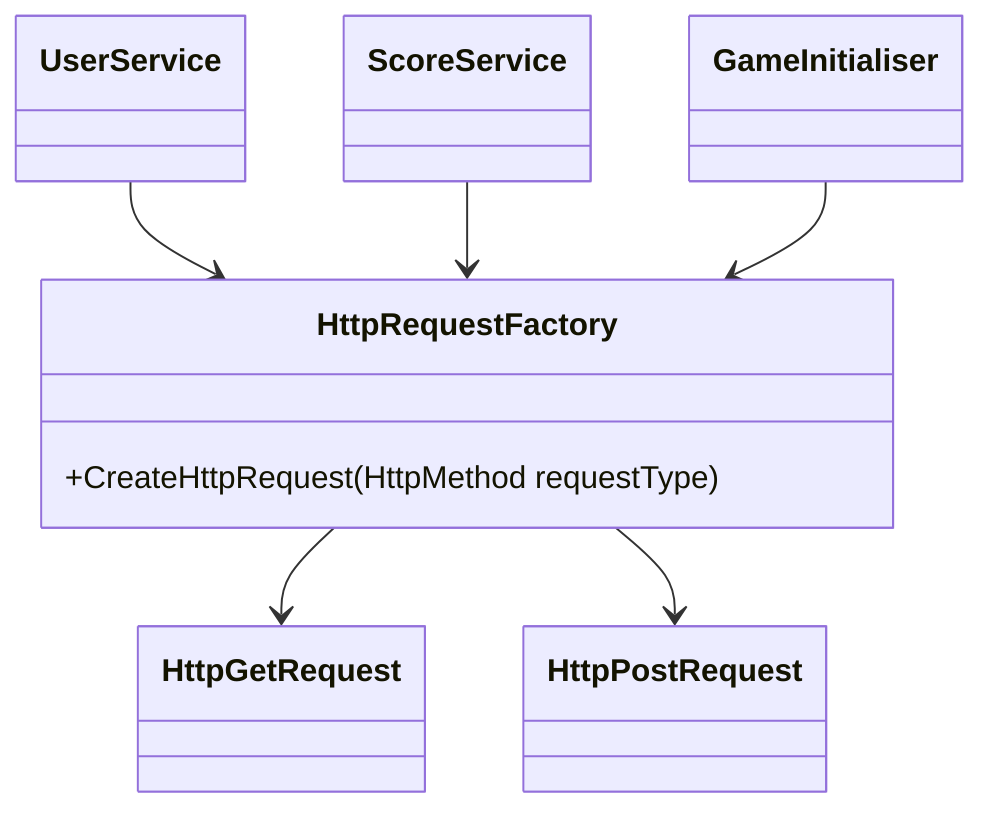

The <SwmToken path="unity/four-block/Assets/network/HttpRequestFactory.cs" pos="6:5:5" line-data="    public class HttpRequestFactory">`HttpRequestFactory`</SwmToken> is a class responsible for creating HTTP request objects based on the specified HTTP method.

It supports creating GET and POST requests by returning instances of <SwmToken path="unity/four-block/Assets/network/HttpRequestFactory.cs" pos="12:5:5" line-data="                return new HttpGetRequest();">`HttpGetRequest`</SwmToken> and <SwmToken path="unity/four-block/Assets/network/HttpRequestFactory.cs" pos="16:5:5" line-data="                return new HttpPostRequest();">`HttpPostRequest`</SwmToken>, respectively.

If an invalid HTTP method is provided, the factory throws an <SwmToken path="unity/four-block/Assets/network/HttpRequestFactory.cs" pos="20:5:5" line-data="                throw new ArgumentException(&quot;Invalid request type&quot;);">`ArgumentException`</SwmToken>.

The <SwmToken path="unity/four-block/Assets/network/HttpRequestFactory.cs" pos="8:5:5" line-data="        public IHttpRequest CreateHttpRequest(HttpMethod requestType)">`CreateHttpRequest`</SwmToken> method is used in various services such as <SwmToken path="unity/four-block/Assets/network/user/UserService.cs" pos="6:5:5" line-data="    public class UserService">`UserService`</SwmToken>, <SwmToken path="unity/four-block/Assets/network/score/ScoreService.cs" pos="6:5:5" line-data="    public class ScoreService">`ScoreService`</SwmToken>, and <SwmToken path="unity/four-block/Assets/Initialisation/GameInitialiser.cs" pos="14:4:4" line-data="public class GameInitialiser : MonoBehaviour">`GameInitialiser`</SwmToken> to generate the appropriate HTTP request objects.

<SwmSnippet path="/unity/four-block/Assets/network/HttpRequestFactory.cs" line="6">

---

# How to use <SwmToken path="unity/four-block/Assets/network/HttpRequestFactory.cs" pos="6:5:5" line-data="    public class HttpRequestFactory">`HttpRequestFactory`</SwmToken>

The <SwmToken path="unity/four-block/Assets/network/HttpRequestFactory.cs" pos="6:5:5" line-data="    public class HttpRequestFactory">`HttpRequestFactory`</SwmToken> class contains the <SwmToken path="unity/four-block/Assets/network/HttpRequestFactory.cs" pos="8:5:5" line-data="        public IHttpRequest CreateHttpRequest(HttpMethod requestType)">`CreateHttpRequest`</SwmToken> method, which takes an <SwmToken path="unity/four-block/Assets/network/HttpRequestFactory.cs" pos="8:7:7" line-data="        public IHttpRequest CreateHttpRequest(HttpMethod requestType)">`HttpMethod`</SwmToken> as a parameter and returns the corresponding request object.

```c#
    public class HttpRequestFactory
    {
        public IHttpRequest CreateHttpRequest(HttpMethod requestType)
        {
            if (requestType == HttpMethod.Get)
            {
                return new HttpGetRequest();
            }
            else if (requestType == HttpMethod.Post)
            {
                return new HttpPostRequest();
            }
            else
            {
                throw new ArgumentException("Invalid request type");
            }
        }
    }
```

---

</SwmSnippet>



<SwmSnippet path="/unity/four-block/Assets/network/user/UserService.cs" line="10">

---

In <SwmToken path="unity/four-block/Assets/network/user/UserService.cs" pos="6:5:5" line-data="    public class UserService">`UserService`</SwmToken>, the <SwmToken path="unity/four-block/Assets/network/user/UserService.cs" pos="10:3:3" line-data="            var httpRequestFactory = new HttpRequestFactory();">`httpRequestFactory`</SwmToken> is used to create a GET request object, which is then used to execute a request to fetch the username.

```c#
            var httpRequestFactory = new HttpRequestFactory();
            var getRequest = (HttpGetRequest)httpRequestFactory.CreateHttpRequest(HttpMethod.Get);
            var getResponse = getRequest.ExecuteAsync("https://liamlime.com/api/user/username/1");
```

---

</SwmSnippet>

<SwmSnippet path="/unity/four-block/Assets/network/score/ScoreService.cs" line="10">

---

In <SwmToken path="unity/four-block/Assets/network/score/ScoreService.cs" pos="6:5:5" line-data="    public class ScoreService">`ScoreService`</SwmToken>, the <SwmToken path="unity/four-block/Assets/network/score/ScoreService.cs" pos="10:3:3" line-data="            var httpRequestFactory = new HttpRequestFactory();">`httpRequestFactory`</SwmToken> is used to create a POST request object, which is then used to submit a score.

```c#
            var httpRequestFactory = new HttpRequestFactory();
            var postRequest = (HttpPostRequest)httpRequestFactory.CreateHttpRequest(HttpMethod.Post);
            var postResponse = postRequest
```

---

</SwmSnippet>

<SwmSnippet path="/unity/four-block/Assets/Initialisation/GameInitialiser.cs" line="26">

---

In <SwmToken path="unity/four-block/Assets/Initialisation/GameInitialiser.cs" pos="14:4:4" line-data="public class GameInitialiser : MonoBehaviour">`GameInitialiser`</SwmToken>, the <SwmToken path="unity/four-block/Assets/Initialisation/GameInitialiser.cs" pos="26:3:3" line-data="        var httpRequestFactory = new HttpRequestFactory();">`httpRequestFactory`</SwmToken> is used to create both GET and POST request objects, demonstrating its versatility in handling different types of HTTP requests.

```c#
        var httpRequestFactory = new HttpRequestFactory();
        var getRequest = (HttpGetRequest)httpRequestFactory.CreateHttpRequest(HttpMethod.Get);
        var postRequest = httpRequestFactory.CreateHttpRequest(HttpMethod.Post);
```

---

</SwmSnippet>

&nbsp;

*This is an auto-generated document by Swimm AI 🌊 and has not yet been verified by a human*

<SwmMeta version="3.0.0" repo-id="Z2l0aHViJTNBJTNBREVNTy1ncmF2aXR5LWN1YmVzJTNBJTNBc3dpbW1pbw==" repo-name="DEMO-gravity-cubes"><sup>Powered by [Swimm](https://staging.swimm.cloud/)</sup></SwmMeta>
