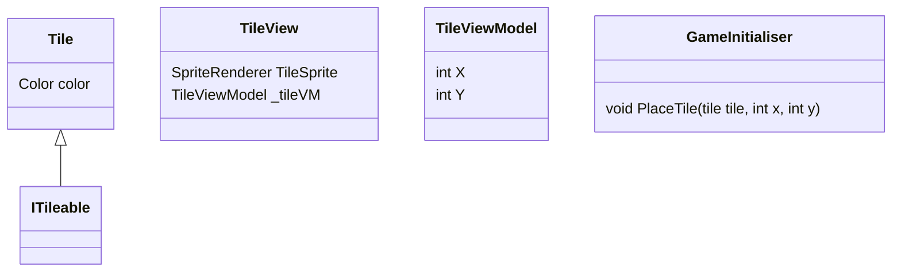

Tile is a fundamental class that represents a single block in the game. It implements the <SwmToken path="unity/four-block/Assets/game/logic/tile/Tile.cs" pos="5:8:8" line-data="    public class Tile: ITileable">`ITileable`</SwmToken> interface, ensuring that it adheres to a specific contract required for tiles in the game.

Each Tile has a color property, which is set during its instantiation. This color property is crucial for distinguishing between different types of tiles visually.

The Tile class is part of the <SwmToken path="unity/four-block/Assets/game/logic/tile/Tile.cs" pos="3:2:6" line-data="namespace game.logic.tile">`game.logic.tile`</SwmToken> namespace, which organizes all tile-related logic and functionality. This includes the <SwmToken path="unity/four-block/Assets/game/logic/tile/TileView.cs" pos="5:5:5" line-data="    public class TileView : MonoBehaviour">`TileView`</SwmToken> and <SwmToken path="unity/four-block/Assets/game/logic/tile/TileView.cs" pos="9:3:3" line-data="        private TileViewModel _tileVM;">`TileViewModel`</SwmToken> classes, which handle the visual representation and the data-binding aspects of the tiles, respectively.

The Tile class is also associated with a prefab, which defines its appearance and behavior in the Unity game engine. This prefab includes components like <SwmToken path="unity/four-block/Assets/game/logic/tile/TileView.cs" pos="7:3:3" line-data="        public SpriteRenderer TileSprite;">`SpriteRenderer`</SwmToken> to render the tile's sprite and other necessary components for its functionality.

<SwmSnippet path="/unity/four-block/Assets/game/logic/tile/Tile.cs" line="5">

---

# Tile Class

The Tile class represents a single block in the game and implements the <SwmToken path="unity/four-block/Assets/game/logic/tile/Tile.cs" pos="5:8:8" line-data="    public class Tile: ITileable">`ITileable`</SwmToken> interface. It has a color property set during instantiation, which is crucial for distinguishing different types of tiles.

```c#
    public class Tile: ITileable
    {
        public Tile(Color color)
        {
            Color = color;
        }

        public Color Color { get; }
    }
```

---

</SwmSnippet>

<SwmSnippet path="/unity/four-block/Assets/game/logic/tile/TileView.cs" line="5">

---

# <SwmToken path="unity/four-block/Assets/game/logic/tile/TileView.cs" pos="5:5:5" line-data="    public class TileView : MonoBehaviour">`TileView`</SwmToken> Class

The <SwmToken path="unity/four-block/Assets/game/logic/tile/TileView.cs" pos="5:5:5" line-data="    public class TileView : MonoBehaviour">`TileView`</SwmToken> class handles the visual representation of the Tile. It uses a <SwmToken path="unity/four-block/Assets/game/logic/tile/TileView.cs" pos="7:3:3" line-data="        public SpriteRenderer TileSprite;">`SpriteRenderer`</SwmToken> to render the tile's sprite and updates its position based on the <SwmToken path="unity/four-block/Assets/game/logic/tile/TileView.cs" pos="9:3:3" line-data="        private TileViewModel _tileVM;">`TileViewModel`</SwmToken>.

```c#
    public class TileView : MonoBehaviour
    {
        public SpriteRenderer TileSprite;
        
        private TileViewModel _tileVM;

        private void Start()
        {
        }
        
        public void Link(TileViewModel tileVM)
        {
            _tileVM = tileVM;
            this.transform.position = new Vector3(tileVM.X, tileVM.Y, 0);
        }

        void Update()
        {
            // Update the view based on the _tileVM here
        }
    }
```

---

</SwmSnippet>

<SwmSnippet path="/unity/four-block/Assets/game/logic/tile/Tile.prefab" line="111">

---

# Tile Prefab

The Tile prefab defines the appearance and behavior of the Tile in the Unity game engine. It includes components like <SwmToken path="unity/four-block/Assets/game/logic/tile/TileView.cs" pos="7:3:3" line-data="        public SpriteRenderer TileSprite;">`SpriteRenderer`</SwmToken> to render the tile's sprite.

```prefab
  m_Layer: 0
  m_Name: Tile
  m_TagString: Untagged
```

---

</SwmSnippet>

<SwmSnippet path="/unity/four-block/Assets/Initialisation/GameInitialiser.cs" line="41">

---

# Tile Usage in Game Initialization

During game initialization, a Tile is instantiated with a specific color and placed on the playfield using the <SwmToken path="unity/four-block/Assets/Initialisation/GameInitialiser.cs" pos="33:9:9" line-data="        var playFieldVM = new PlayFieldViewModel(playField, serviceLocator);">`PlayFieldViewModel`</SwmToken>.

```c#
            {
                var tile = new Tile(Color.black);
                playFieldVM.PlaceTile(tile, x, y);
```

---

</SwmSnippet>



&nbsp;

*This is an auto-generated document by Swimm AI 🌊 and has not yet been verified by a human*

<SwmMeta version="3.0.0" repo-id="Z2l0aHViJTNBJTNBREVNTy1ncmF2aXR5LWN1YmVzJTNBJTNBc3dpbW1pbw==" repo-name="DEMO-gravity-cubes" doc-type="overview"><sup>Powered by [Swimm](/)</sup></SwmMeta>
