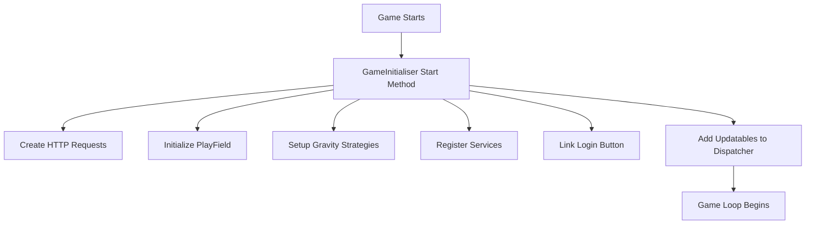

Game Initialization refers to the setup process that prepares the game environment before the player starts interacting with it.

The <SwmToken path="unity/four-block/Assets/Initialisation/GameInitialiser.cs" pos="14:4:4" line-data="public class GameInitialiser : MonoBehaviour">`GameInitialiser`</SwmToken> class is responsible for this setup, and it is executed when the game starts.

First, it creates HTTP request objects for GET and POST methods using the <SwmToken path="unity/four-block/Assets/Initialisation/GameInitialiser.cs" pos="26:3:3" line-data="        var httpRequestFactory = new HttpRequestFactory();">`httpRequestFactory`</SwmToken>.

A <SwmToken path="unity/four-block/Assets/Initialisation/GameInitialiser.cs" pos="30:3:3" line-data="        var serviceLocator = new ServiceLocator();">`serviceLocator`</SwmToken> is instantiated to manage various game services.

A <SwmToken path="unity/four-block/Assets/Initialisation/GameInitialiser.cs" pos="32:3:3" line-data="        var playField = new PlayField();">`playField`</SwmToken> object is created, and its corresponding view model <SwmToken path="unity/four-block/Assets/Initialisation/GameInitialiser.cs" pos="33:9:9" line-data="        var playFieldVM = new PlayFieldViewModel(playField, serviceLocator);">`PlayFieldViewModel`</SwmToken> is linked to a visual representation <SwmToken path="unity/four-block/Assets/Initialisation/GameInitialiser.cs" pos="16:3:3" line-data="    public PlayFieldView PlayFieldPrefab;">`PlayFieldView`</SwmToken>.

The game board is populated with tiles by iterating over the playfield dimensions and placing tiles at each position.

Different gravity strategies are initialized, and one is selected randomly to be used by the <SwmToken path="unity/four-block/Assets/Initialisation/GameInitialiser.cs" pos="56:9:9" line-data="        var gravity = new GravityService(gravityStrategy);">`GravityService`</SwmToken>.

The <SwmToken path="unity/four-block/Assets/Initialisation/GameInitialiser.cs" pos="59:9:9" line-data="        var spawner = new TileSpawnerService();">`TileSpawnerService`</SwmToken> and <SwmToken path="unity/four-block/Assets/Initialisation/GameInitialiser.cs" pos="5:6:6" line-data="using game.logic.EventQueue;">`EventQueue`</SwmToken> are also registered with the <SwmToken path="unity/four-block/Assets/Initialisation/GameInitialiser.cs" pos="30:3:3" line-data="        var serviceLocator = new ServiceLocator();">`serviceLocator`</SwmToken>.

The login button is linked to the event queue to handle user interactions.

A <SwmToken path="unity/four-block/Assets/Initialisation/GameInitialiser.cs" pos="10:2:2" line-data="using gamerunner;">`gamerunner`</SwmToken> is created to manage the game loop, and it is added to the <SwmToken path="unity/four-block/Assets/Initialisation/GameInitialiser.cs" pos="22:3:3" line-data="    public Dispatcher Dispatcher;">`Dispatcher`</SwmToken> along with other updatable components like gravity and the playfield view model.

Finally, the <SwmToken path="unity/four-block/Assets/Initialisation/GameInitialiser.cs" pos="14:4:4" line-data="public class GameInitialiser : MonoBehaviour">`GameInitialiser`</SwmToken> object is destroyed to clean up the initialization process.

<SwmSnippet path="/unity/four-block/Assets/Initialisation/GameInitialiser.cs" line="14">

---

## <SwmToken path="unity/four-block/Assets/Initialisation/GameInitialiser.cs" pos="14:4:4" line-data="public class GameInitialiser : MonoBehaviour">`GameInitialiser`</SwmToken> Class

The <SwmToken path="unity/four-block/Assets/Initialisation/GameInitialiser.cs" pos="14:4:4" line-data="public class GameInitialiser : MonoBehaviour">`GameInitialiser`</SwmToken> class is responsible for setting up the game environment. It creates HTTP request objects, initializes the playfield, sets up gravity strategies, and registers services.

```c#
public class GameInitialiser : MonoBehaviour
{
    public PlayFieldView PlayFieldPrefab;
    public TileView TilePrefab;
    
    [SerializeField]
    public LoginButton _loginButton;

    public Dispatcher Dispatcher;
    
    void Start()
    {
        var httpRequestFactory = new HttpRequestFactory();
        var getRequest = (HttpGetRequest)httpRequestFactory.CreateHttpRequest(HttpMethod.Get);
        var postRequest = httpRequestFactory.CreateHttpRequest(HttpMethod.Post);
        
        var serviceLocator = new ServiceLocator();
        
        var playField = new PlayField();
        var playFieldVM = new PlayFieldViewModel(playField, serviceLocator);
        
```

---

</SwmSnippet>

<SwmSnippet path="/unity/four-block/Assets/Initialisation/GameInitialiser.cs" line="24">

---

## Start Method

The <SwmToken path="unity/four-block/Assets/Initialisation/GameInitialiser.cs" pos="24:3:3" line-data="    void Start()">`Start`</SwmToken> method in the <SwmToken path="unity/four-block/Assets/Initialisation/GameInitialiser.cs" pos="14:4:4" line-data="public class GameInitialiser : MonoBehaviour">`GameInitialiser`</SwmToken> class performs the initialization tasks. It creates HTTP requests, sets up the playfield and its view model, populates the playfield with tiles, initializes gravity strategies, registers services, links the login button, and adds updatable components to the dispatcher.

```c#
    void Start()
    {
        var httpRequestFactory = new HttpRequestFactory();
        var getRequest = (HttpGetRequest)httpRequestFactory.CreateHttpRequest(HttpMethod.Get);
        var postRequest = httpRequestFactory.CreateHttpRequest(HttpMethod.Post);
        
        var serviceLocator = new ServiceLocator();
        
        var playField = new PlayField();
        var playFieldVM = new PlayFieldViewModel(playField, serviceLocator);
        
        var playFieldView = GameObject.Instantiate(PlayFieldPrefab);
        playFieldView.Link(playFieldVM);
        
        for (int x = 0; x < playFieldVM.Width; x++)
        {
            for (int y = 0; y < playFieldVM.Height; y++)
            {
                var tile = new Tile(Color.black);
                playFieldVM.PlaceTile(tile, x, y);
                
```

---

</SwmSnippet>

<SwmSnippet path="/unity/four-block/Assets/network/HttpRequestFactory.cs" line="8">

---

## Creating HTTP Requests

The <SwmToken path="unity/four-block/Assets/network/HttpRequestFactory.cs" pos="8:5:5" line-data="        public IHttpRequest CreateHttpRequest(HttpMethod requestType)">`CreateHttpRequest`</SwmToken> method in the <SwmToken path="unity/four-block/Assets/Initialisation/GameInitialiser.cs" pos="26:3:3" line-data="        var httpRequestFactory = new HttpRequestFactory();">`httpRequestFactory`</SwmToken> class is used to create HTTP GET and POST requests during the game initialization.

```c#
        public IHttpRequest CreateHttpRequest(HttpMethod requestType)
        {
            if (requestType == HttpMethod.Get)
            {
                return new HttpGetRequest();
            }
            else if (requestType == HttpMethod.Post)
            {
                return new HttpPostRequest();
            }
            else
            {
                throw new ArgumentException("Invalid request type");
            }
        }
```

---

</SwmSnippet>

<SwmSnippet path="/unity/four-block/Assets/game/logic/playfield/PlayFieldViewModel.cs" line="43">

---

## Placing Tiles

The <SwmToken path="unity/four-block/Assets/game/logic/playfield/PlayFieldViewModel.cs" pos="43:5:5" line-data="        public void PlaceTile(ITileable tile, int x, int y)">`PlaceTile`</SwmToken> method in the <SwmToken path="unity/four-block/Assets/Initialisation/GameInitialiser.cs" pos="33:9:9" line-data="        var playFieldVM = new PlayFieldViewModel(playField, serviceLocator);">`PlayFieldViewModel`</SwmToken> class is used to place tiles on the playfield during the initialization process.

```c#
        public void PlaceTile(ITileable tile, int x, int y)
        {
            _playField.Field[x, y] = tile;
        }
```

---

</SwmSnippet>

<SwmSnippet path="/unity/four-block/Assets/game/service/ServiceLocator.cs" line="27">

---

## Registering Services

The <SwmToken path="unity/four-block/Assets/game/service/ServiceLocator.cs" pos="27:5:5" line-data="        public void RegisterService&lt;T&gt;(T service) where T: IService">`RegisterService`</SwmToken> method in the <SwmToken path="unity/four-block/Assets/Initialisation/GameInitialiser.cs" pos="30:3:3" line-data="        var serviceLocator = new ServiceLocator();">`serviceLocator`</SwmToken> class is used to register various services like gravity, tile spawner, and event queue during the game initialization.

```c#
        public void RegisterService<T>(T service) where T: IService
        {
            services[typeof(T)] = service;
        }
```

---

</SwmSnippet>



# Main functions

There are several main functions in this folder. Some of them are Start, <SwmToken path="unity/four-block/Assets/Initialisation/GameInitialiser.cs" pos="27:12:12" line-data="        var getRequest = (HttpGetRequest)httpRequestFactory.CreateHttpRequest(HttpMethod.Get);">`CreateHttpRequest`</SwmToken>, <SwmToken path="unity/four-block/Assets/Initialisation/GameInitialiser.cs" pos="43:3:3" line-data="                playFieldVM.PlaceTile(tile, x, y);">`PlaceTile`</SwmToken>, and <SwmToken path="unity/four-block/Assets/game/service/ServiceLocator.cs" pos="27:5:5" line-data="        public void RegisterService&lt;T&gt;(T service) where T: IService">`RegisterService`</SwmToken>. We will dive a little into Start.

<SwmSnippet path="/unity/four-block/Assets/Initialisation/GameInitialiser.cs" line="24">

---

## Start

The <SwmToken path="unity/four-block/Assets/Initialisation/GameInitialiser.cs" pos="24:3:3" line-data="    void Start()">`Start`</SwmToken> function is the main entry point for game initialization. It sets up HTTP requests, service locators, playfield, gravity strategies, tile spawner, event queue, and game runner. It also links the login button to the event queue and adds updatable components to the dispatcher.

```c#
    void Start()
    {
        var httpRequestFactory = new HttpRequestFactory();
        var getRequest = (HttpGetRequest)httpRequestFactory.CreateHttpRequest(HttpMethod.Get);
        var postRequest = httpRequestFactory.CreateHttpRequest(HttpMethod.Post);
        
        var serviceLocator = new ServiceLocator();
        
        var playField = new PlayField();
        var playFieldVM = new PlayFieldViewModel(playField, serviceLocator);
        
        var playFieldView = GameObject.Instantiate(PlayFieldPrefab);
        playFieldView.Link(playFieldVM);
        
        for (int x = 0; x < playFieldVM.Width; x++)
        {
            for (int y = 0; y < playFieldVM.Height; y++)
            {
                var tile = new Tile(Color.black);
                playFieldVM.PlaceTile(tile, x, y);
                
```

---

</SwmSnippet>

&nbsp;

*This is an auto-generated document by Swimm AI 🌊 and has not yet been verified by a human*

<SwmMeta version="3.0.0" repo-id="Z2l0aHViJTNBJTNBREVNTy1ncmF2aXR5LWN1YmVzJTNBJTNBc3dpbW1pbw==" repo-name="DEMO-gravity-cubes" doc-type="overview"><sup>Powered by [Swimm](/)</sup></SwmMeta>
