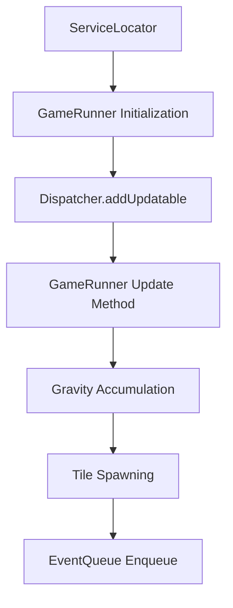

Game Runner is a class responsible for managing the game's core loop and interactions.

It implements the <SwmToken path="unity/four-block/Assets/gamerunner/GameRunner.cs" pos="11:8:8" line-data="public class GameRunner : IUpdatable">`IUpdatable`</SwmToken> interface, which requires an <SwmToken path="unity/four-block/Assets/gamerunner/GameRunner.cs" pos="24:5:5" line-data="    public void Update()">`Update`</SwmToken> method to be defined.

The <SwmToken path="unity/four-block/Assets/gamerunner/GameRunner.cs" pos="19:3:3" line-data="    public GameRunner(ServiceLocator serviceLocator)">`GameRunner`</SwmToken> class uses a <SwmToken path="unity/four-block/Assets/gamerunner/GameRunner.cs" pos="19:5:5" line-data="    public GameRunner(ServiceLocator serviceLocator)">`ServiceLocator`</SwmToken> to access various services like <SwmToken path="unity/four-block/Assets/gamerunner/GameRunner.cs" pos="26:11:11" line-data="        var gravity = _serviceLocator.GetService&lt;GravityService&gt;();">`GravityService`</SwmToken>, <SwmToken path="unity/four-block/Assets/gamerunner/GameRunner.cs" pos="31:11:11" line-data="            var spawner = _serviceLocator.GetService&lt;TileSpawnerService&gt;();">`TileSpawnerService`</SwmToken>, and <SwmToken path="unity/four-block/Assets/gamerunner/GameRunner.cs" pos="39:3:3" line-data="            var eventQueue = _serviceLocator.GetService&lt;EventQueue&gt;();">`eventQueue`</SwmToken>.

In the <SwmToken path="unity/four-block/Assets/gamerunner/GameRunner.cs" pos="24:5:5" line-data="    public void Update()">`Update`</SwmToken> method, it accumulates gravity values and increments a frame counter.

When the accumulated gravity exceeds a threshold, it resets the counters and spawns a new tile shape using the <SwmToken path="unity/four-block/Assets/gamerunner/GameRunner.cs" pos="31:11:11" line-data="            var spawner = _serviceLocator.GetService&lt;TileSpawnerService&gt;();">`TileSpawnerService`</SwmToken>.

The new tile shape is then enqueued into the <SwmToken path="unity/four-block/Assets/gamerunner/GameRunner.cs" pos="39:3:3" line-data="            var eventQueue = _serviceLocator.GetService&lt;EventQueue&gt;();">`eventQueue`</SwmToken> as a <SwmToken path="unity/four-block/Assets/gamerunner/GameRunner.cs" pos="40:7:7" line-data="            eventQueue.Enqueue(new SpawnTileEvent(this, CreateTileShape));">`SpawnTileEvent`</SwmToken>.

The <SwmToken path="unity/four-block/Assets/gamerunner/GameRunner.cs" pos="19:3:3" line-data="    public GameRunner(ServiceLocator serviceLocator)">`GameRunner`</SwmToken> is initialized in the <SwmToken path="unity/four-block/Assets/Initialisation/GameInitialiser.cs" pos="14:4:4" line-data="public class GameInitialiser : MonoBehaviour">`GameInitialiser`</SwmToken> and added to the <SwmToken path="unity/four-block/Assets/Initialisation/GameInitialiser.cs" pos="68:1:1" line-data="        Dispatcher.addUpdatable(gameRunner);">`Dispatcher`</SwmToken> for regular updates.

<SwmSnippet path="/unity/four-block/Assets/gamerunner/GameRunner.cs" line="19">

---

# Initialization

The <SwmToken path="unity/four-block/Assets/gamerunner/GameRunner.cs" pos="19:3:3" line-data="    public GameRunner(ServiceLocator serviceLocator)">`GameRunner`</SwmToken> is initialized with a <SwmToken path="unity/four-block/Assets/gamerunner/GameRunner.cs" pos="19:5:5" line-data="    public GameRunner(ServiceLocator serviceLocator)">`ServiceLocator`</SwmToken>, which provides access to various game services.

```c#
    public GameRunner(ServiceLocator serviceLocator)
    {
        _serviceLocator = serviceLocator;
    }
```

---

</SwmSnippet>

<SwmSnippet path="/unity/four-block/Assets/Initialisation/GameInitialiser.cs" line="67">

---

# Adding to Dispatcher

The <SwmToken path="unity/four-block/Assets/Initialisation/GameInitialiser.cs" pos="67:3:3" line-data="        var gameRunner = new GameRunner(serviceLocator);">`gameRunner`</SwmToken> is added to the Dispatcher to ensure its Update method is called regularly.

```c#
        var gameRunner = new GameRunner(serviceLocator);
        Dispatcher.addUpdatable(gameRunner);
```

---

</SwmSnippet>

<SwmSnippet path="/unity/four-block/Assets/gamerunner/GameRunner.cs" line="24">

---

# Update Method

The Update method accumulates gravity values, increments a frame counter, and spawns new tile shapes when the accumulated gravity exceeds a threshold.

```c#
    public void Update()
    {
        var gravity = _serviceLocator.GetService<GravityService>();
        _gravitySum += gravity.CurrentGravity;
        frames++;
        if(_gravitySum > 100.0f)
        {
            var spawner = _serviceLocator.GetService<TileSpawnerService>();
            frames = 0;
            _gravitySum = 0.0f;
            if (CreateTileShape == null)
            {
                CreateTileShape = spawner.Spawn();    
            }
            
            var eventQueue = _serviceLocator.GetService<EventQueue>();
            eventQueue.Enqueue(new SpawnTileEvent(this, CreateTileShape));
            
            CreateTileShape = spawner.Spawn();
        }
    }
```

---

</SwmSnippet>

<SwmSnippet path="/unity/four-block/Assets/game/logic/EventQueue/EventQueue.cs" line="15">

---

# Enqueuing Events

The new tile shape is enqueued into the <SwmToken path="unity/four-block/Assets/gamerunner/GameRunner.cs" pos="39:3:3" line-data="            var eventQueue = _serviceLocator.GetService&lt;EventQueue&gt;();">`eventQueue`</SwmToken> as a <SwmToken path="unity/four-block/Assets/gamerunner/GameRunner.cs" pos="40:7:7" line-data="            eventQueue.Enqueue(new SpawnTileEvent(this, CreateTileShape));">`SpawnTileEvent`</SwmToken>.

```c#
        public void Enqueue(IEvent e)
        {
            if(!_queues.ContainsKey(e.Id))
            {
                _queues[e.Id] = new Queue<IEvent>();
            }
            _queues[e.Id].Enqueue(e);
        }
```

---

</SwmSnippet>



&nbsp;

*This is an auto-generated document by Swimm AI 🌊 and has not yet been verified by a human*

<SwmMeta version="3.0.0" repo-id="Z2l0aHViJTNBJTNBREVNTy1ncmF2aXR5LWN1YmVzJTNBJTNBc3dpbW1pbw==" repo-name="DEMO-gravity-cubes" doc-type="overview"><sup>Powered by [Swimm](/)</sup></SwmMeta>
