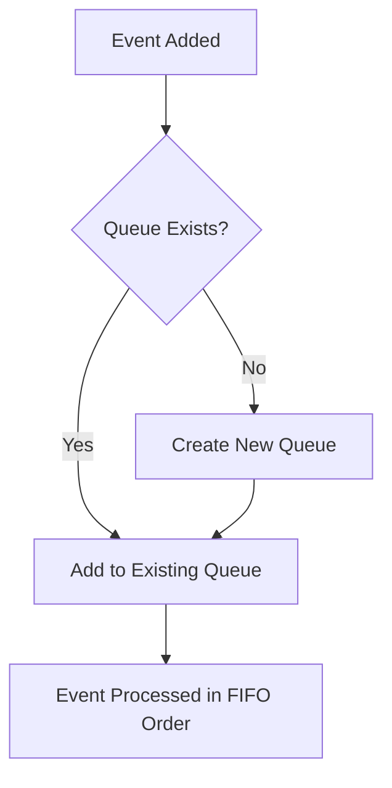

The Event Queue is a mechanism that manages events in the game by storing them in a queue structure.

It uses a dictionary to map event IDs to their respective queues, ensuring that events are organized and can be accessed efficiently.

When an event is added to the queue using the <SwmToken path="unity/four-block/Assets/game/logic/EventQueue/EventQueue.cs" pos="15:5:5" line-data="        public void Enqueue(IEvent e)">`Enqueue`</SwmToken> method, it checks if a queue for the event ID already exists. If not, it creates a new queue for that event ID.

The <SwmToken path="unity/four-block/Assets/game/logic/EventQueue/EventQueue.cs" pos="26:5:5" line-data="        public IEvent Dequeue(EventId id)">`Dequeue`</SwmToken> method is used to retrieve and remove the next event from the queue for a given event ID, allowing the game to process events in the order they were added.

The Event Queue ensures that events are handled in a first-in, first-out (FIFO) manner, which is crucial for maintaining the correct sequence of game actions.

<SwmSnippet path="/unity/four-block/Assets/game/logic/EventQueue/EventQueue.cs" line="6">

---

# Event Queue

The <SwmToken path="unity/four-block/Assets/game/logic/EventQueue/EventQueue.cs" pos="6:5:5" line-data="    public class EventQueue: IService">`EventQueue`</SwmToken> class manages events using a dictionary to map event IDs to their respective queues. It provides methods to enqueue and dequeue events, ensuring they are processed in a first-in, first-out (FIFO) manner.

```c#
    public class EventQueue: IService
    {
        private Dictionary<EventId, Queue<IEvent>> _queues;
        
        public EventQueue()
        {
            _queues = new Dictionary<EventId, Queue<IEvent>>();
        }
        
        public void Enqueue(IEvent e)
        {
            if(!_queues.ContainsKey(e.Id))
            {
                _queues[e.Id] = new Queue<IEvent>();
            }
            _queues[e.Id].Enqueue(e);
        }

        public bool HasEvent(EventId id) => _queues.ContainsKey(id) && _queues[id].Count > 0;

        public IEvent Dequeue(EventId id)
```

---

</SwmSnippet>

<SwmSnippet path="/unity/four-block/Assets/game/logic/EventQueue/EventQueue.cs" line="15">

---

The <SwmToken path="unity/four-block/Assets/game/logic/EventQueue/EventQueue.cs" pos="15:5:5" line-data="        public void Enqueue(IEvent e)">`Enqueue`</SwmToken> method adds an event to the queue. If a queue for the event ID does not exist, it creates a new one.

```c#
        public void Enqueue(IEvent e)
        {
            if(!_queues.ContainsKey(e.Id))
            {
                _queues[e.Id] = new Queue<IEvent>();
            }
            _queues[e.Id].Enqueue(e);
        }
```

---

</SwmSnippet>

<SwmSnippet path="/unity/four-block/Assets/game/logic/EventQueue/EventQueue.cs" line="26">

---

The <SwmToken path="unity/four-block/Assets/game/logic/EventQueue/EventQueue.cs" pos="26:5:5" line-data="        public IEvent Dequeue(EventId id)">`Dequeue`</SwmToken> method retrieves and removes the next event from the queue for a given event ID.

```c#
        public IEvent Dequeue(EventId id)
        {
            if (HasEvent(id))
            {
                return _queues[id].Dequeue();
            }
            return null;
        }
```

---

</SwmSnippet>



# Main functions

There are several main functions in this folder. Some of them are <SwmToken path="unity/four-block/Assets/game/logic/EventQueue/EventQueue.cs" pos="6:5:5" line-data="    public class EventQueue: IService">`EventQueue`</SwmToken>, Enqueue, Dequeue, and <SwmToken path="unity/four-block/Assets/game/logic/EventQueue/EventQueue.cs" pos="24:5:5" line-data="        public bool HasEvent(EventId id) =&gt; _queues.ContainsKey(id) &amp;&amp; _queues[id].Count &gt; 0;">`HasEvent`</SwmToken>. We will dive a little into Enqueue and Dequeue.

<SwmSnippet path="/unity/four-block/Assets/game/logic/EventQueue/EventQueue.cs" line="15">

---

## Enqueue

The <SwmToken path="unity/four-block/Assets/game/logic/EventQueue/EventQueue.cs" pos="15:5:5" line-data="        public void Enqueue(IEvent e)">`Enqueue`</SwmToken> function is used to add an event to the queue. It checks if a queue for the event ID already exists. If not, it creates a new queue for that event ID and then adds the event to the queue.

```c#
        public void Enqueue(IEvent e)
        {
            if(!_queues.ContainsKey(e.Id))
            {
                _queues[e.Id] = new Queue<IEvent>();
            }
            _queues[e.Id].Enqueue(e);
        }
```

---

</SwmSnippet>

<SwmSnippet path="/unity/four-block/Assets/game/logic/EventQueue/EventQueue.cs" line="26">

---

## Dequeue

The <SwmToken path="unity/four-block/Assets/game/logic/EventQueue/EventQueue.cs" pos="26:5:5" line-data="        public IEvent Dequeue(EventId id)">`Dequeue`</SwmToken> function is used to retrieve and remove the next event from the queue for a given event ID. It first checks if there are any events in the queue for the specified event ID and then removes and returns the next event.

```c#
        public IEvent Dequeue(EventId id)
        {
            if (HasEvent(id))
            {
                return _queues[id].Dequeue();
            }
            return null;
        }
```

---

</SwmSnippet>

&nbsp;

*This is an auto-generated document by Swimm AI 🌊 and has not yet been verified by a human*

<SwmMeta version="3.0.0" repo-id="Z2l0aHViJTNBJTNBREVNTy1ncmF2aXR5LWN1YmVzJTNBJTNBc3dpbW1pbw==" repo-name="DEMO-gravity-cubes" doc-type="overview"><sup>Powered by [Swimm](/)</sup></SwmMeta>
