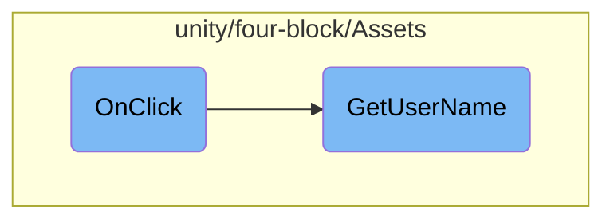

In this document, we will explain the process triggered by the <SwmToken path="unity/four-block/Assets/LoginButton.cs" pos="29:5:5" line-data="    public void OnClick()">`OnClick`</SwmToken> method when a user attempts to log in. The process involves creating a service instance, retrieving the username, and enqueuing a login event.

When the login button is clicked, the <SwmToken path="unity/four-block/Assets/LoginButton.cs" pos="29:5:5" line-data="    public void OnClick()">`OnClick`</SwmToken> method is triggered. This method creates an instance of <SwmToken path="unity/four-block/Assets/LoginButton.cs" pos="31:1:1" line-data="        UserService userService = new UserService();">`UserService`</SwmToken> to fetch the username by making an HTTP GET request. Once the username is retrieved, it is added to an event queue as a <SwmToken path="unity/four-block/Assets/LoginButton.cs" pos="33:7:7" line-data="        _eventQueue.Enqueue(new UserLoginEvent(this, userName));">`UserLoginEvent`</SwmToken>, which can then be processed by the system.

# Flow drill down



<SwmSnippet path="/unity/four-block/Assets/LoginButton.cs" line="29">

---

## Handling user login

The <SwmToken path="unity/four-block/Assets/LoginButton.cs" pos="29:5:5" line-data="    public void OnClick()">`OnClick`</SwmToken> method is responsible for handling the user login process. When the login button is clicked, it creates an instance of <SwmToken path="unity/four-block/Assets/LoginButton.cs" pos="31:1:1" line-data="        UserService userService = new UserService();">`UserService`</SwmToken> and calls the <SwmToken path="unity/four-block/Assets/LoginButton.cs" pos="32:9:9" line-data="        var userName = userService.GetUserName();">`GetUserName`</SwmToken> method to retrieve the username. The retrieved username is then enqueued into the <SwmToken path="unity/four-block/Assets/LoginButton.cs" pos="33:1:1" line-data="        _eventQueue.Enqueue(new UserLoginEvent(this, userName));">`_eventQueue`</SwmToken> as a <SwmToken path="unity/four-block/Assets/LoginButton.cs" pos="33:7:7" line-data="        _eventQueue.Enqueue(new UserLoginEvent(this, userName));">`UserLoginEvent`</SwmToken>.

```c#
    public void OnClick()
    {
        UserService userService = new UserService();
        var userName = userService.GetUserName();
        _eventQueue.Enqueue(new UserLoginEvent(this, userName));
    }
```

---

</SwmSnippet>

<SwmSnippet path="/unity/four-block/Assets/network/user/UserService.cs" line="8">

---

### Retrieving the username

The <SwmToken path="unity/four-block/Assets/network/user/UserService.cs" pos="8:5:5" line-data="        public string GetUserName()">`GetUserName`</SwmToken> method in <SwmToken path="unity/four-block/Assets/LoginButton.cs" pos="31:1:1" line-data="        UserService userService = new UserService();">`UserService`</SwmToken> is responsible for making an HTTP GET request to fetch the username. It uses <SwmToken path="unity/four-block/Assets/network/user/UserService.cs" pos="10:3:3" line-data="            var httpRequestFactory = new HttpRequestFactory();">`httpRequestFactory`</SwmToken> to create the request and executes it asynchronously. The response is then logged and returned as the username.

```c#
        public string GetUserName()
        {
            var httpRequestFactory = new HttpRequestFactory();
            var getRequest = (HttpGetRequest)httpRequestFactory.CreateHttpRequest(HttpMethod.Get);
            var getResponse = getRequest.ExecuteAsync("https://liamlime.com/api/user/username/1");
            getResponse.Wait();
            var result = getResponse.Result;
            Debug.Log(result);
            return result;
        }
```

---

</SwmSnippet>

&nbsp;

*This is an auto-generated document by Swimm AI 🌊 and has not yet been verified by a human*

<SwmMeta version="3.0.0" repo-id="Z2l0aHViJTNBJTNBREVNTy1ncmF2aXR5LWN1YmVzJTNBJTNBc3dpbW1pbw==" repo-name="DEMO-gravity-cubes"><sup>Powered by [Swimm](/)</sup></SwmMeta>
