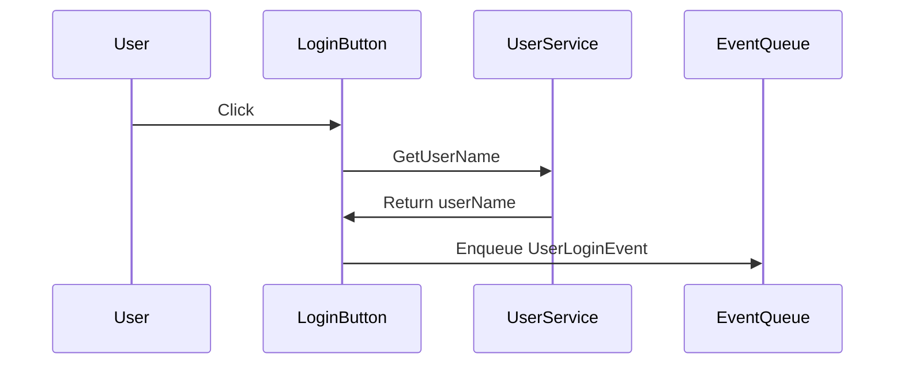

The Login Button is a Unity component that handles user login interactions.

It is linked to an <SwmToken path="unity/four-block/Assets/LoginButton.cs" pos="24:7:7" line-data="    public void Link(EventQueue eventQueue)">`EventQueue`</SwmToken> to manage events triggered by user actions.

When the Login Button is clicked, it calls the <SwmToken path="unity/four-block/Assets/LoginButton.cs" pos="29:5:5" line-data="    public void OnClick()">`OnClick`</SwmToken> method.

The <SwmToken path="unity/four-block/Assets/LoginButton.cs" pos="29:5:5" line-data="    public void OnClick()">`OnClick`</SwmToken> method creates an instance of <SwmToken path="unity/four-block/Assets/LoginButton.cs" pos="31:1:1" line-data="        UserService userService = new UserService();">`UserService`</SwmToken> to fetch the username.

The username is retrieved using the <SwmToken path="unity/four-block/Assets/LoginButton.cs" pos="32:9:9" line-data="        var userName = userService.GetUserName();">`GetUserName`</SwmToken> method from <SwmToken path="unity/four-block/Assets/LoginButton.cs" pos="31:1:1" line-data="        UserService userService = new UserService();">`UserService`</SwmToken>.

After obtaining the username, the <SwmToken path="unity/four-block/Assets/LoginButton.cs" pos="29:5:5" line-data="    public void OnClick()">`OnClick`</SwmToken> method enqueues a <SwmToken path="unity/four-block/Assets/LoginButton.cs" pos="33:7:7" line-data="        _eventQueue.Enqueue(new UserLoginEvent(this, userName));">`UserLoginEvent`</SwmToken> into the <SwmToken path="unity/four-block/Assets/LoginButton.cs" pos="24:7:7" line-data="    public void Link(EventQueue eventQueue)">`EventQueue`</SwmToken>.

The <SwmToken path="unity/four-block/Assets/LoginButton.cs" pos="24:5:5" line-data="    public void Link(EventQueue eventQueue)">`Link`</SwmToken> method is used to associate the <SwmToken path="unity/four-block/Assets/LoginButton.cs" pos="24:7:7" line-data="    public void Link(EventQueue eventQueue)">`EventQueue`</SwmToken> with the Login Button.

<SwmSnippet path="/unity/four-block/Assets/LoginButton.cs" line="24">

---

## Linking the <SwmToken path="unity/four-block/Assets/LoginButton.cs" pos="24:7:7" line-data="    public void Link(EventQueue eventQueue)">`EventQueue`</SwmToken>

The <SwmToken path="unity/four-block/Assets/LoginButton.cs" pos="24:5:5" line-data="    public void Link(EventQueue eventQueue)">`Link`</SwmToken> method is used to associate the <SwmToken path="unity/four-block/Assets/LoginButton.cs" pos="24:7:7" line-data="    public void Link(EventQueue eventQueue)">`EventQueue`</SwmToken> with the Login Button, allowing it to manage events triggered by user actions.

```c#
    public void Link(EventQueue eventQueue)
    {
        _eventQueue = eventQueue;
    }
```

---

</SwmSnippet>

<SwmSnippet path="/unity/four-block/Assets/LoginButton.cs" line="29">

---

## Handling Click Events

When the Login Button is clicked, the <SwmToken path="unity/four-block/Assets/LoginButton.cs" pos="29:5:5" line-data="    public void OnClick()">`OnClick`</SwmToken> method is called. This method creates an instance of <SwmToken path="unity/four-block/Assets/LoginButton.cs" pos="31:1:1" line-data="        UserService userService = new UserService();">`UserService`</SwmToken> to fetch the username and enqueues a <SwmToken path="unity/four-block/Assets/LoginButton.cs" pos="33:7:7" line-data="        _eventQueue.Enqueue(new UserLoginEvent(this, userName));">`UserLoginEvent`</SwmToken> into the <SwmToken path="unity/four-block/Assets/LoginButton.cs" pos="24:7:7" line-data="    public void Link(EventQueue eventQueue)">`EventQueue`</SwmToken>.

```c#
    public void OnClick()
    {
        UserService userService = new UserService();
        var userName = userService.GetUserName();
        _eventQueue.Enqueue(new UserLoginEvent(this, userName));
    }
```

---

</SwmSnippet>

<SwmSnippet path="/unity/four-block/Assets/network/user/UserService.cs" line="8">

---

## Fetching the Username

The <SwmToken path="unity/four-block/Assets/network/user/UserService.cs" pos="8:5:5" line-data="        public string GetUserName()">`GetUserName`</SwmToken> method in <SwmToken path="unity/four-block/Assets/LoginButton.cs" pos="31:1:1" line-data="        UserService userService = new UserService();">`UserService`</SwmToken> is used to retrieve the username by making an HTTP GET request.

```c#
        public string GetUserName()
        {
            var httpRequestFactory = new HttpRequestFactory();
            var getRequest = (HttpGetRequest)httpRequestFactory.CreateHttpRequest(HttpMethod.Get);
            var getResponse = getRequest.ExecuteAsync("https://liamlime.com/api/user/username/1");
            getResponse.Wait();
            var result = getResponse.Result;
            Debug.Log(result);
            return result;
        }
```

---

</SwmSnippet>

<SwmSnippet path="/unity/four-block/Assets/game/logic/EventQueue/EventQueue.cs" line="15">

---

## Enqueuing the <SwmToken path="unity/four-block/Assets/LoginButton.cs" pos="33:7:7" line-data="        _eventQueue.Enqueue(new UserLoginEvent(this, userName));">`UserLoginEvent`</SwmToken>

The <SwmToken path="unity/four-block/Assets/game/logic/EventQueue/EventQueue.cs" pos="15:5:5" line-data="        public void Enqueue(IEvent e)">`Enqueue`</SwmToken> method in <SwmToken path="unity/four-block/Assets/LoginButton.cs" pos="24:7:7" line-data="    public void Link(EventQueue eventQueue)">`EventQueue`</SwmToken> is used to add the <SwmToken path="unity/four-block/Assets/LoginButton.cs" pos="33:7:7" line-data="        _eventQueue.Enqueue(new UserLoginEvent(this, userName));">`UserLoginEvent`</SwmToken> to the queue, ensuring that the event is processed accordingly.

```c#
        public void Enqueue(IEvent e)
        {
            if(!_queues.ContainsKey(e.Id))
            {
                _queues[e.Id] = new Queue<IEvent>();
            }
            _queues[e.Id].Enqueue(e);
        }
```

---

</SwmSnippet>



# Main functions

There are several main functions in this class. Some of them are Start, Update, Link, and <SwmToken path="unity/four-block/Assets/LoginButton.cs" pos="29:5:5" line-data="    public void OnClick()">`OnClick`</SwmToken>. We will dive a little into Link and <SwmToken path="unity/four-block/Assets/LoginButton.cs" pos="29:5:5" line-data="    public void OnClick()">`OnClick`</SwmToken>.

<SwmSnippet path="/unity/four-block/Assets/LoginButton.cs" line="24">

---

## Link

The <SwmToken path="unity/four-block/Assets/LoginButton.cs" pos="24:5:5" line-data="    public void Link(EventQueue eventQueue)">`Link`</SwmToken> function is used to associate the <SwmToken path="unity/four-block/Assets/LoginButton.cs" pos="24:7:7" line-data="    public void Link(EventQueue eventQueue)">`EventQueue`</SwmToken> with the Login Button. This allows the button to enqueue events when clicked.

```c#
    public void Link(EventQueue eventQueue)
    {
        _eventQueue = eventQueue;
    }
```

---

</SwmSnippet>

<SwmSnippet path="/unity/four-block/Assets/LoginButton.cs" line="29">

---

## <SwmToken path="unity/four-block/Assets/LoginButton.cs" pos="29:5:5" line-data="    public void OnClick()">`OnClick`</SwmToken>

The <SwmToken path="unity/four-block/Assets/LoginButton.cs" pos="29:5:5" line-data="    public void OnClick()">`OnClick`</SwmToken> function handles the click event of the Login Button. It creates an instance of <SwmToken path="unity/four-block/Assets/LoginButton.cs" pos="31:1:1" line-data="        UserService userService = new UserService();">`UserService`</SwmToken> to fetch the username and then enqueues a <SwmToken path="unity/four-block/Assets/LoginButton.cs" pos="33:7:7" line-data="        _eventQueue.Enqueue(new UserLoginEvent(this, userName));">`UserLoginEvent`</SwmToken> into the <SwmToken path="unity/four-block/Assets/LoginButton.cs" pos="24:7:7" line-data="    public void Link(EventQueue eventQueue)">`EventQueue`</SwmToken> with the retrieved username.

```c#
    public void OnClick()
    {
        UserService userService = new UserService();
        var userName = userService.GetUserName();
        _eventQueue.Enqueue(new UserLoginEvent(this, userName));
    }
```

---

</SwmSnippet>

&nbsp;

*This is an auto-generated document by Swimm AI 🌊 and has not yet been verified by a human*

<SwmMeta version="3.0.0" repo-id="Z2l0aHViJTNBJTNBREVNTy1ncmF2aXR5LWN1YmVzJTNBJTNBc3dpbW1pbw==" repo-name="DEMO-gravity-cubes" doc-type="overview"><sup>Powered by [Swimm](/)</sup></SwmMeta>
