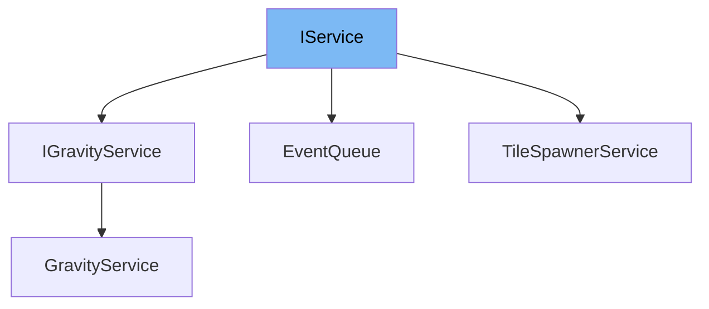

This document will cover the interface <SwmToken path="unity/four-block/Assets/game/service/IService.cs" pos="3:5:5" line-data="    public interface IService">`IService`</SwmToken> in the Unity project. We will discuss:

1. What <SwmToken path="unity/four-block/Assets/game/service/IService.cs" pos="3:5:5" line-data="    public interface IService">`IService`</SwmToken> is.
2. The variables and functions defined in <SwmToken path="unity/four-block/Assets/game/service/IService.cs" pos="3:5:5" line-data="    public interface IService">`IService`</SwmToken>.
3. An example of how to use <SwmToken path="unity/four-block/Assets/game/service/IService.cs" pos="3:5:5" line-data="    public interface IService">`IService`</SwmToken> in <SwmToken path="unity/four-block/Assets/game/logic/tilespawner/TileSpawnerService.cs" pos="10:5:5" line-data="    public class TileSpawnerService: IService">`TileSpawnerService`</SwmToken>.



# What is <SwmToken path="unity/four-block/Assets/game/service/IService.cs" pos="3:5:5" line-data="    public interface IService">`IService`</SwmToken>

<SwmToken path="unity/four-block/Assets/game/service/IService.cs" pos="3:5:5" line-data="    public interface IService">`IService`</SwmToken> is an interface defined in the Unity project under the namespace <SwmToken path="unity/four-block/Assets/game/logic/tilespawner/TileSpawnerService.cs" pos="4:2:4" line-data="using game.service;">`game.service`</SwmToken>. It serves as a contract for service classes, ensuring that any class implementing this interface adheres to a specific structure and set of functionalities. This is useful for maintaining consistency and predictability across different service implementations in the game.

<SwmSnippet path="/unity/four-block/Assets/game/service/IService.cs" line="3">

---

# Variables and functions

The <SwmToken path="unity/four-block/Assets/game/service/IService.cs" pos="3:5:5" line-data="    public interface IService">`IService`</SwmToken> interface is defined here. Currently, it does not contain any variables or functions, serving as a marker interface for now.

```c#
    public interface IService
    {
        
    }
```

---

</SwmSnippet>

# Usage example

To illustrate how <SwmToken path="unity/four-block/Assets/game/service/IService.cs" pos="3:5:5" line-data="    public interface IService">`IService`</SwmToken> can be used, let's look at an example with <SwmToken path="unity/four-block/Assets/game/logic/tilespawner/TileSpawnerService.cs" pos="10:5:5" line-data="    public class TileSpawnerService: IService">`TileSpawnerService`</SwmToken>.

<SwmSnippet path="/unity/four-block/Assets/game/logic/tilespawner/TileSpawnerService.cs" line="1">

---

<SwmToken path="unity/four-block/Assets/game/logic/tilespawner/TileSpawnerService.cs" pos="10:5:5" line-data="    public class TileSpawnerService: IService">`TileSpawnerService`</SwmToken> implements the <SwmToken path="unity/four-block/Assets/game/service/IService.cs" pos="3:5:5" line-data="    public interface IService">`IService`</SwmToken> interface. This shows how a service class can adhere to the <SwmToken path="unity/four-block/Assets/game/service/IService.cs" pos="3:5:5" line-data="    public interface IService">`IService`</SwmToken> contract, even though <SwmToken path="unity/four-block/Assets/game/service/IService.cs" pos="3:5:5" line-data="    public interface IService">`IService`</SwmToken> currently does not define any specific methods or properties.

```c#
using System;
using System.Collections.Generic;
using System.Linq;
using game.service;
using Unity.VisualScripting;
using Random = System.Random;

```

---

</SwmSnippet>

&nbsp;

*This is an auto-generated document by Swimm AI 🌊 and has not yet been verified by a human*

<SwmMeta version="3.0.0" repo-id="Z2l0aHViJTNBJTNBREVNTy1ncmF2aXR5LWN1YmVzJTNBJTNBc3dpbW1pbw==" repo-name="DEMO-gravity-cubes" doc-type="class"><sup>Powered by [Swimm](/)</sup></SwmMeta>
