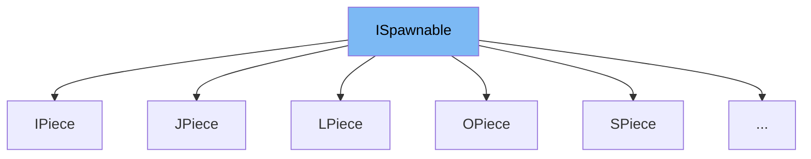

This document will cover the interface <SwmToken path="unity/four-block/Assets/game/logic/tilespawner/SPiece.cs" pos="7:8:8" line-data="    public class SPiece: ISpawnable">`ISpawnable`</SwmToken>. We will discuss:

1. What <SwmToken path="unity/four-block/Assets/game/logic/tilespawner/SPiece.cs" pos="7:8:8" line-data="    public class SPiece: ISpawnable">`ISpawnable`</SwmToken> is.
2. The variables and functions defined in <SwmToken path="unity/four-block/Assets/game/logic/tilespawner/SPiece.cs" pos="7:8:8" line-data="    public class SPiece: ISpawnable">`ISpawnable`</SwmToken>.
3. An example of how to use <SwmToken path="unity/four-block/Assets/game/logic/tilespawner/SPiece.cs" pos="7:8:8" line-data="    public class SPiece: ISpawnable">`ISpawnable`</SwmToken> in <SwmToken path="unity/four-block/Assets/game/logic/tilespawner/SPiece.cs" pos="7:5:5" line-data="    public class SPiece: ISpawnable">`SPiece`</SwmToken>.



# What is <SwmToken path="unity/four-block/Assets/game/logic/tilespawner/SPiece.cs" pos="7:8:8" line-data="    public class SPiece: ISpawnable">`ISpawnable`</SwmToken>

The <SwmToken path="unity/four-block/Assets/game/logic/tilespawner/SPiece.cs" pos="7:8:8" line-data="    public class SPiece: ISpawnable">`ISpawnable`</SwmToken> interface in <SwmPath>[unity/four-block/Assets/game/logic/tilespawner/ISpawnable.cs](unity/four-block/Assets/game/logic/tilespawner/ISpawnable.cs)</SwmPath> is used to define a contract for objects that can be spawned in the game. It ensures that any class implementing this interface will provide an implementation for the <SwmToken path="unity/four-block/Assets/game/logic/tilespawner/ISpawnable.cs" pos="7:3:3" line-data="        ITileable Spawn();">`Spawn`</SwmToken> method, which is responsible for creating and returning an instance of <SwmToken path="unity/four-block/Assets/game/logic/tilespawner/ISpawnable.cs" pos="7:1:1" line-data="        ITileable Spawn();">`ITileable`</SwmToken>.

<SwmSnippet path="/unity/four-block/Assets/game/logic/tilespawner/ISpawnable.cs" line="7">

---

# Variables and functions

The <SwmToken path="unity/four-block/Assets/game/logic/tilespawner/ISpawnable.cs" pos="7:3:3" line-data="        ITileable Spawn();">`Spawn`</SwmToken> function is the only method defined in the <SwmToken path="unity/four-block/Assets/game/logic/tilespawner/SPiece.cs" pos="7:8:8" line-data="    public class SPiece: ISpawnable">`ISpawnable`</SwmToken> interface. It is used to create and return an instance of <SwmToken path="unity/four-block/Assets/game/logic/tilespawner/ISpawnable.cs" pos="7:1:1" line-data="        ITileable Spawn();">`ITileable`</SwmToken>.

```c#
        ITileable Spawn();
    }
```

---

</SwmSnippet>

# Usage example

Here is an example of how to use the <SwmToken path="unity/four-block/Assets/game/logic/tilespawner/SPiece.cs" pos="7:8:8" line-data="    public class SPiece: ISpawnable">`ISpawnable`</SwmToken> interface in the <SwmToken path="unity/four-block/Assets/game/logic/tilespawner/SPiece.cs" pos="7:5:5" line-data="    public class SPiece: ISpawnable">`SPiece`</SwmToken> class.

<SwmSnippet path="/unity/four-block/Assets/game/logic/tilespawner/SPiece.cs" line="6">

---

The <SwmToken path="unity/four-block/Assets/game/logic/tilespawner/SPiece.cs" pos="7:5:5" line-data="    public class SPiece: ISpawnable">`SPiece`</SwmToken> class implements the <SwmToken path="unity/four-block/Assets/game/logic/tilespawner/SPiece.cs" pos="7:8:8" line-data="    public class SPiece: ISpawnable">`ISpawnable`</SwmToken> interface. It provides an implementation for the <SwmToken path="unity/four-block/Assets/game/logic/tilespawner/ISpawnable.cs" pos="7:3:3" line-data="        ITileable Spawn();">`Spawn`</SwmToken> method, which creates and returns an instance of <SwmToken path="unity/four-block/Assets/game/logic/tilespawner/ISpawnable.cs" pos="7:1:1" line-data="        ITileable Spawn();">`ITileable`</SwmToken>.

```c#
{
    public class SPiece: ISpawnable
    {
```

---

</SwmSnippet>

&nbsp;

*This is an auto-generated document by Swimm AI 🌊 and has not yet been verified by a human*

<SwmMeta version="3.0.0" repo-id="Z2l0aHViJTNBJTNBREVNTy1ncmF2aXR5LWN1YmVzJTNBJTNBc3dpbW1pbw==" repo-name="DEMO-gravity-cubes" doc-type="class"><sup>Powered by [Swimm](/)</sup></SwmMeta>
