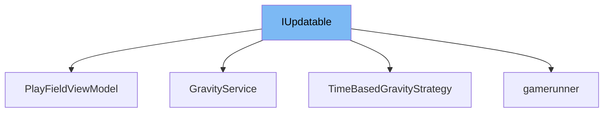

This document will cover the interface <SwmToken path="unity/four-block/Assets/gamerunner/IUpdatable.cs" pos="3:5:5" line-data="    public interface IUpdatable">`IUpdatable`</SwmToken> in the repo. We will cover:

1. What <SwmToken path="unity/four-block/Assets/gamerunner/IUpdatable.cs" pos="3:5:5" line-data="    public interface IUpdatable">`IUpdatable`</SwmToken> is in the repo.
2. IUpdatable's main variables and functions.
3. Example of how to use <SwmToken path="unity/four-block/Assets/gamerunner/IUpdatable.cs" pos="3:5:5" line-data="    public interface IUpdatable">`IUpdatable`</SwmToken> in <SwmToken path="unity/four-block/Assets/game/logic/playfield/PlayFieldViewModel.cs" pos="9:5:5" line-data="    public class PlayFieldViewModel: IUpdatable">`PlayFieldViewModel`</SwmToken>.



# What is <SwmToken path="unity/four-block/Assets/gamerunner/IUpdatable.cs" pos="3:5:5" line-data="    public interface IUpdatable">`IUpdatable`</SwmToken>

The <SwmToken path="unity/four-block/Assets/gamerunner/IUpdatable.cs" pos="3:5:5" line-data="    public interface IUpdatable">`IUpdatable`</SwmToken> interface in <SwmPath>[unity/four-block/Assets/gamerunner/IUpdatable.cs](unity/four-block/Assets/gamerunner/IUpdatable.cs)</SwmPath> is used to define a contract for objects that need to be updated regularly. This is typically used in game development to ensure that certain objects can be updated every frame or at regular intervals.

<SwmSnippet path="/unity/four-block/Assets/gamerunner/IUpdatable.cs" line="3">

---

# Variables and functions

The <SwmToken path="unity/four-block/Assets/gamerunner/IUpdatable.cs" pos="5:5:5" line-data="        public void Update();">`Update`</SwmToken> function is the only method defined in the <SwmToken path="unity/four-block/Assets/gamerunner/IUpdatable.cs" pos="3:5:5" line-data="    public interface IUpdatable">`IUpdatable`</SwmToken> interface. It is intended to be implemented by any class that needs to perform actions on a regular update cycle.

```c#
    public interface IUpdatable
    {
        public void Update();
    }
```

---

</SwmSnippet>

# Usage example

Here is an example of how to use <SwmToken path="unity/four-block/Assets/gamerunner/IUpdatable.cs" pos="3:5:5" line-data="    public interface IUpdatable">`IUpdatable`</SwmToken> in the <SwmToken path="unity/four-block/Assets/game/logic/playfield/PlayFieldViewModel.cs" pos="9:5:5" line-data="    public class PlayFieldViewModel: IUpdatable">`PlayFieldViewModel`</SwmToken> class.

<SwmSnippet path="/unity/four-block/Assets/game/logic/playfield/PlayFieldViewModel.cs" line="8">

---

The <SwmToken path="unity/four-block/Assets/game/logic/playfield/PlayFieldViewModel.cs" pos="9:5:5" line-data="    public class PlayFieldViewModel: IUpdatable">`PlayFieldViewModel`</SwmToken> class implements the <SwmToken path="unity/four-block/Assets/game/logic/playfield/PlayFieldViewModel.cs" pos="9:8:8" line-data="    public class PlayFieldViewModel: IUpdatable">`IUpdatable`</SwmToken> interface. This means it must provide an implementation for the <SwmToken path="unity/four-block/Assets/gamerunner/IUpdatable.cs" pos="5:5:5" line-data="        public void Update();">`Update`</SwmToken> method, allowing it to be updated regularly within the game loop.

```c#
{
    public class PlayFieldViewModel: IUpdatable
    {
```

---

</SwmSnippet>

&nbsp;

*This is an auto-generated document by Swimm AI 🌊 and has not yet been verified by a human*

<SwmMeta version="3.0.0" repo-id="Z2l0aHViJTNBJTNBREVNTy1ncmF2aXR5LWN1YmVzJTNBJTNBc3dpbW1pbw==" repo-name="DEMO-gravity-cubes" doc-type="class"><sup>Powered by [Swimm](/)</sup></SwmMeta>
