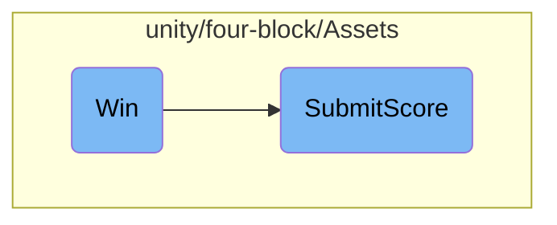

In this document, we will explain the process that occurs when a player wins the game. The process involves retrieving the player's score, creating a score service, and submitting the score to a remote server.

When a player wins the game, the system retrieves the player's score from an input field. It then creates an instance of a score service, which is responsible for handling the score submission. The score service sends the score to a remote server using an HTTP POST request. The server's response is logged for debugging purposes.

# Flow drill down



<SwmSnippet path="/unity/four-block/Assets/ScoreSubmit.cs" line="27">

---

## Winning the Game

The <SwmToken path="unity/four-block/Assets/ScoreSubmit.cs" pos="27:5:5" line-data="    public void Win()">`Win`</SwmToken> method is responsible for handling the event when a player wins the game. It retrieves the score from the input field, creates an instance of <SwmToken path="unity/four-block/Assets/ScoreSubmit.cs" pos="30:1:1" line-data="        ScoreService scoreService = new ScoreService();">`ScoreService`</SwmToken>, and calls the <SwmToken path="unity/four-block/Assets/ScoreSubmit.cs" pos="31:3:3" line-data="        scoreService.SubmitScore(score);">`SubmitScore`</SwmToken> method to submit the score.

```c#
    public void Win()
    {
        var score = int.Parse(_inputField.text);
        ScoreService scoreService = new ScoreService();
        scoreService.SubmitScore(score);
    }
```

---

</SwmSnippet>

<SwmSnippet path="/unity/four-block/Assets/network/score/ScoreService.cs" line="8">

---

## Submitting the Score

The <SwmToken path="unity/four-block/Assets/network/score/ScoreService.cs" pos="8:5:5" line-data="        public void SubmitScore(int score)">`SubmitScore`</SwmToken> method in <SwmToken path="unity/four-block/Assets/ScoreSubmit.cs" pos="30:1:1" line-data="        ScoreService scoreService = new ScoreService();">`ScoreService`</SwmToken> handles the process of sending the player's score to a remote server. It creates an HTTP POST request, sets the score data, and sends the request to the specified API endpoint. The response is logged for debugging purposes.

```c#
        public void SubmitScore(int score)
        {
            var httpRequestFactory = new HttpRequestFactory();
            var postRequest = (HttpPostRequest)httpRequestFactory.CreateHttpRequest(HttpMethod.Post);
            var postResponse = postRequest
                .SetData("{\"score\": "+score+"}")
                .SetClient(new HttpClient())
                .ExecuteAsync("https://liamlime.com/api/user/score/1");
            postResponse.ContinueWith(task =>
            {
                var result = postResponse.Result;
                Debug.Log(result);
            });
        }
```

---

</SwmSnippet>

&nbsp;

*This is an auto-generated document by Swimm AI 🌊 and has not yet been verified by a human*

<SwmMeta version="3.0.0" repo-id="Z2l0aHViJTNBJTNBREVNTy1ncmF2aXR5LWN1YmVzJTNBJTNBc3dpbW1pbw==" repo-name="DEMO-gravity-cubes"><sup>Powered by [Swimm](/)</sup></SwmMeta>
